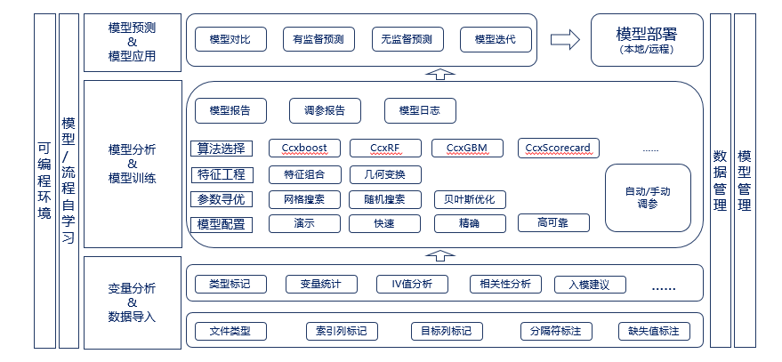
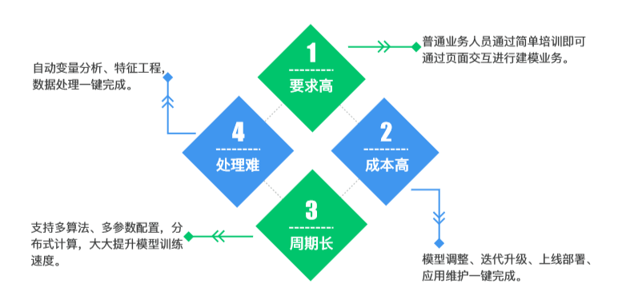

# 2.平台简介

## 2.1 AIMS介绍

AIMS是中诚信征信基于机器学习与人工智能技术自主研发的智能建模平台，对数据分析与建模的整体流程实现程序化，并将特征工程、算法选择与参数调优，实现智能化。在平台上用户可以通过载入数据，结合自己的业务目标进行模型选择、模型应用以及模型自学习的过程。AIMS平台的程序化、智能化能帮助用户轻松实现数据分析和模型开发。

## 2.2 平台功能

万象智慧平台是一个针对非专业建模人员的机器学习平台，相对于传统的对建模人员专业要求高，数据处理慢以及建模周期长的建模方式，使用万向智慧平台不仅能够大大降低构建模型的门槛，还能够优化建模全流程，达到快速高效建模的效果，用户只需通过简洁的可视化界面操作即可完成复杂的机器学习任务。平台具体功能如下：

- **变量分析**
  - **类型标记**：数据导入过程中，系统自动解析数据并校验数据格式，会依据变量取值范围自动判断该变量属于离散性或连续型；
  - **变量统计**：对数据进行描述性统计分析，发现每个变量的数据组成情况；
  - **IV值分析**：计算变量IV值，且可下载IV值分析文件查看变量相关性、入模建议等分析结果；
  - **特征工程**：支持自动独热编码，自动处理缺失值和异常值和自动衍生特征。
- **模型训练**
  - **算法选择**：平台提供Ccxboost、CcxRF、Ccxgbm、CcxScorecard等多种建模算法；
  - **参数寻优**：参数寻优主要方法有网格搜索、随机搜索和贝叶斯寻优；
    - **网格搜索**：指定参数值的一种穷举搜索方法,通过将估计函数的参数通过交叉验证的方法进行优化来得到最优的学习算法；
    - **随机搜索**：为每个参数定义了一个分布函数并在该空间中采样寻找最优参数，是一种更为高效的参数调优方法；
    - **贝叶斯寻优**：是在函数方程不知的情况下根据已有的采样点预估函数最大值的一种算法；
  - **模型配置**：当前系统提供默认配置，包括演示、快速、精确、高可靠四种，用户也可选择手动调参模式，对模型参数进行设置；
    - **演示**：采用默认2组参数训练模型，专为演示使用;
    - **快速**：采用少量参数训练模型，能迅速的建立模型；
    - **精准**：模型在更大的搜索空间进行模型超参数寻优，使得模型的预测效果更为精确；
    - **高可靠**：寻优模型的同时不断的剔除对模型贡献率低的变量，去除数据噪声，使得模型更稳健；
    - **手动调参**：用户根据自己的需求配置参数组合训练模型；
  - **报告输出**：支持模型训练中参数报告输出，模型训练后的模型报告输出；
- **模型应用**
  - **模型对比**：支持多模型结果比较，选择最优模型；
  - **有监督预测**：支持对有分类结果的数据进行预测;
  - **无监督预测**：支持对无分类结果的数据进行预测；
- **模型部署**
  - 可一键实现本地或远程服务器上的模型部署。

AIMS整个功能架构图如下：

更多平台功能持续开发中，尽力打造更智能的机器学习平台。

## 2.3 平台特点

   万象智慧平台具有如下特点：
- **低门槛**：业务人员、非专业建模人员无需掌握算法和编程便可建立机器学习模型；
- **易操作**：通过web可视化界面，轻松完成建模，操作流程简便；
- **快捷性**：一键提取模型，提供模型部署接口文档；
- **灵活性**：建模的全流程，可人工交互，也可后台自动运行，支持云端访问或本地化部署；
- **创新性**：特征工程的应用创新性，自动超参数寻优，模型寻优的算法创新性；
- **易管理**：可按时间、数据对模型进行归类、管理、对比。

