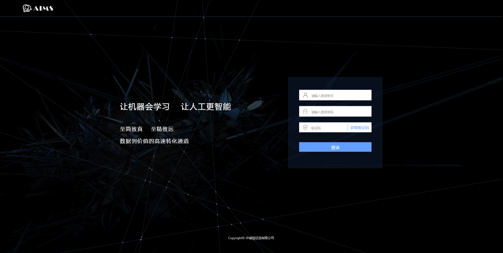

# 3. 操作指引

## 3.1 平台登录

平台浏览器兼容：IE11、360、火狐、chrome，推荐chrome
如图-1为本系统的登录界面。

## 3.2 数据分析

该模块主要包括数据探索阶段的数据文件上传、类型标记、变量分析功能。

### 3.2.1数据上传
    
    1、点击浏览后可以选择本地文件，选择文件后框内显示文件名称，当前支持标准化数据上传，文件格式支持csv、txt、sas，编码格式为utf-8、gbk两种，
    2、文件名称由用户自定义，不限字符类型（必填）
    3、分隔符：默认为英文逗号、制表符（下拉选择）
    4、缺失值：默认缺失值包括null、-99、空格等（选填）
    5、目标变量：列名，用于确定样本得目标类型（必填）
    6、样本索引：列名，样本ID（必填）
  
完成上述信息填写后，点击导入，后台对导入数据进行校验，导入成功，则在下方列表显示，在列表中可对数据文件进行删除处理。

若数据文件不符合要求，则在页面提示用户下载文件导入日志
 

### 3.2.2类型标记

类型标记主要提供变量删除、中文标记、数据类型标功能。
 

该页面展示所有变量，在变量中文列，用户可添加该变量的中文名称标注，在类型列用户可以通过点击下拉来选择变量为离散或连续，行1至行5列为上传的数据文件的预览展示（默认展示数据文件前五个样本数据）。用户点击底部确定后，触发分析功能。

### 3.2.3变量分析
变量分析中，首先展示变量的基本统计信息，分别按离散性和连续型展示
 

内容区左上角选择IV值分析进入变量分析页面，左侧列表为全部变量以及对应的IV值，点击其中的变量，右侧展示改变量的分析结果，右上角点击下载IV、下载HTML，下载对应分析文件
 

## 3.3模型训练

模型训练模块主要提供模型训练项目的创建、模型效果评估等功能

### 3.3.1项目创建

用户可创建一个模型训练项目，进行如下信息设置即可
1、用户需输入项目名称，同时下拉选择文件名称
2、算法选择，目前支持6种算法，算法选择只能单选
3、模型配置：提供两种方式手动/自动
自动模式下，提供特征工程（选填）、寻优方式（选填/单选）、算法配置（单选）三个模型组件，用户可自主勾选
手动为面向专业人士的模型参数配置页面，用户需对各参数进行设置后开始训练模型

 

用户完成上述配置后，点击项目创建中的开始按钮，系统开始进行模型训练，用户可点击项目列表中的 进行时时日志查看！

### 3.3.2模型评估

模型训练项目完成后，系统自动生成调参报告/分箱结果、模型报告等模型评估文件，用户可点击进行页面查看
 

模型报告中主要展示项目信息、样本信息、模型相关参数、重要变量等。可在右上角进行相关材料的下载以及逻辑回归算法的评分卡生成。
若用户对本次模型训练效果满意，则可点击模型提取，将模型由训练模块提取至模型预测模块

 

## 3.4模型预测

模型预测模块中，用户可对模型进行对比以及预测操作
 

### 3.4.1 模型对比

点击模型预测列表上方的模型对比，进入对比模型选择，
 

用户至多可选择5个算法进行对比，点击开始后，查看对比结果
 

### 3.4.2 模型预测

点击模型预测中模型列表后方的预测按钮，进入预测设置页面
 

进入页面后，用户可选择要预测的数据文件，同时设置预测类型，当前万象智慧提供两种预测模式，分别为有监督、无监督两种

点击开始预测按钮后，列表中自动添加本次预测记录，在预测完成后，用户可查看预测结果及预测报告
 

 

##3.5模型应用

### 3.5.1 模型部署

通过模型部署，用户可将训练后的模型进行实际样本预测
 

用户通过下拉选择要部署应用的模型，点击开始部署，自动完成部署应用，并返回模型调用接口文档以及线上接口测试。
 

 

## 3.6 帮助文档
操作指引、平台简介、算法介绍

## 3.7 Notebook
该模块是面向专业人士提供的在线可编程建模环境，目前集成了Python、R、Spark、

## 3.8用户中心
系统管理模块负责整个系统的用户管理，角色管理，角色管理主要是对角色分配权限，用户管理提供对现有用户进行编辑，用户信息编辑及新增用户。

### 3.8.1 用户管理
	主要功能为对现有用户进行维护及新用户创建。页面通过分页的方式展示机构下所有用户列表。每条记录对应编辑、注销功能。其中用户信息的修改以及完善通过编辑功能实现
 

 

若要删除用户，则点击用户列表中的 删除按钮即可（红色叉号）

### 3.8.2 角色管理
角色管理主要提供角色的维护功能，用户可维护或创建角色，并分配对应权限
 

角色的信息修改通过编辑实现，同时角色创建的信息与维护信息一致
 

## 3.9 用户退出
页面上右上角提供修改密码和用户退出功能，如图 2-35所示。
 

