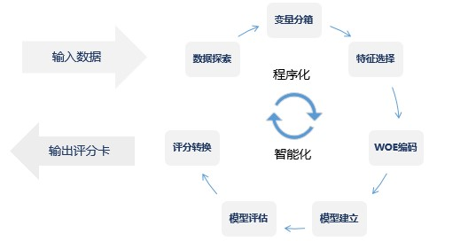

# 4. 算法介绍

## 4.1 平台算法原理及使用说明

  万象智慧平台目前支持的算法有评分卡模型(CcxSocreCard)、随机森林(CcxRF)、CcxBoost、CcxGBM、CcxGBDT、CcxAdboost，平台仍将持续开发上线新的算法。

---

### 4.1.1 [CcxScoreCard](http://mp.weixin.qq.com/s/4QrFAQZbegGT-WK2Ov6wug)

#### CcxScoreCard评分卡算法原理

标准评分卡模型的开发基于逻辑回归，逻辑回归(Logistic Regression)是机器学习中的一种分类模型，是业界常用的监督学习算法，由于算法的简单和高效，在实际中应用非常广泛。如：在广告投放中，判断用户是否会点击广告，营销领域判断用户是否会购买，风控领域判断用户是否会违约等场景。
这里以是否违约为例介绍逻辑回归算法的原理。
发生违约的概率记为$$P(y=1)=p$$ 则逻辑回归模型可以表示为:
$$
p=\frac{1}{1+exp\left ( -\left [ \beta_{0}+\beta_{1}x_{1}+\beta_{2}x_{2}+...+\beta_{n}x_{n}\right ] \right )}
$$  
即有:
$$
LogitP=ln(odds)=ln(\frac{P}{1-P})=\beta_{0}+\beta_{1}x_{1}+\beta_{2}x_{2}+...+\beta_{n}x_{n} = Z
$$

当$$Z$$趋于$$+\infty$$时，$$P$$值渐进于1；当$$Z$$趋于$$-\infty$$时，$$P$$值渐进于0，将$$(-\infty,+\infty)$$通过转换映射到[0,1]之间。
逻辑回归模型的参数估计通常采用最大似然估计，即找到一组参数，使得在这组参数下，似然函数最大。对数似然函数为:
$$
lnL=\sum_{i=1}^{n}\left [ y_{i}lnp_{i}+\left ( 1-y_{i} \right )ln\left ( 1-p_{i} \right )\right ]
$$  
在上述的优化问题中，存在多种求解方法，这里以梯度下降为例说明。梯度下降(Gradient Descent)又称为最速梯度下降，是一种迭代求解的方法，通过在每一步选取使目标函数变化最快的一个方向调整参数的值来逼近最优值。基本步骤如下：

- 选择下降方向，即梯度方向；
- 选择步长，更新参数；
- 重复以上两步直到满足终止条件。

得到回归参数的学习规则：
$$
\theta _{t+1}=\theta _{t}-\alpha \frac{1}{n}\sum_{x\in D_{train}}^{}\bigtriangledown _{\theta }loss\left ( f_{\theta _{t}}\left ( x \right ),y \right )
$$

#### 标准评分卡的开发流程

在标准开发流程基础上，万象智慧平台评分卡模型的开发流程如下：

在建模中，需要对连续变量离散化(即变量分箱)，特征离散化后，模型会更稳定，降低了模型过拟合的风险。万象智慧平台提供了多种变量分箱的方法，按照有无使用目标变量分为无监督分箱方法和有监督分箱方法。最常见的等频分箱和等宽分箱都属于无监督分箱方法，有监督分箱方法包括卡方分箱和决策树分箱。

- **卡方分箱法**

卡方分箱法是自底向上基于合并的数据离散化方法，它依赖于卡方检验，具有最小卡方值的相邻区间合并在一起，直到满足确定的停止规则。卡方分箱法的基本思想是对于精确的离散化，相对类频率在一个区间内应当完全一致。因此，如果两个相邻的区间具有非常类似的类分布，则这两个区间可以合并，低卡方值表明具有相似的类分布，卡方分箱中有两个参数需要设置：

- max_intervals：最大的取值个数，当连续变量的取值个数大于max_intervals时才进行卡方分箱，万象智慧平台默认取值为10；
- threshold：卡方阈值，当变量两区间的卡方值小于等于threshold时才进行合并，万象智慧平台默认取值为5(根据显著性水平和自由度得到卡方值，自由度=1 & 显著性水平=0.025时，即97.5%置信度下，卡方值=5)。

类别和属性独立时,有97.5%的可能性,计算得到的卡方值会小于5。 大于阈值5的卡方值就说明属性和类不是相互独立的，如果阈值选的大,区间合并就会进行很多次,离散后的区间数量少、区间大。

- **决策树分箱法**

决策树采用的是自顶向下的贪婪算法，它会在每个节点选择分类效果最好的属性对样本进行二分类，然后继续这个过程，直到这棵树能够准确的分类训练样本，或者所有的属性都已被用过。决策树算法的核心是在对每个结点进行测试后，选择最佳的属性，并且对决策树进行剪枝处理。这里的剪枝是预剪枝，所谓预剪枝，就是让决策树在生长之前，就定好树的层数，以及每个节点所允许的最少的样本数量，从而达到防止过拟合的效果，通过如下两个参数实现：

- max_depth：决策树的层数，设置为3，表明决策树最多生成8个叶子节点，即变量最多分8箱；
- min_samples_leaf：叶子节点中最少的样本比例或样本数量，设置为0.05，表明每个叶子节点中的样本数量不能少于训练样本的5%，即变量每一箱的样本量不少于训练样本的5% 。

#### 评分卡使用建议

标准评分卡模型通常为需要模型变量在业务上具有可解释性的场景，用户只需要按照要求输入数据，便可得到评分卡输出。

#### 评分卡参数设置

由于评分卡流程中，各步骤实现方法有多种，且对于连续变量和分类变量的处理存在较大差异，因此按照评分卡流程中各步骤进行参数设置的说明。仅列举有参数设置的步骤。

- **数据探索**
  缺失值的处理中，有两个参数设置：
  - UpperLmt：删除掉缺失值比例大于阈值UpperLmt变量;
  - LowerLmt：缺失值比例小于阈值LowerLmt，填补中位数/均值/众数;

缺失值比例介于UpperLmt和LowerLmt的变量，将缺失值单独作为一箱。

- **变量分箱**
  卡方分箱法的参数：
  - max_intervals：最大的取值个数，当连续变量的取值个数大于max_intervals时才进行卡方分箱，万象智慧平台默认取值为10；
  - threshold：卡方阈值，当变量两区间的卡方值小于等于threshold时才进行合并，万象智慧平台默认取值为5;

  决策树分箱法的参数：
  - max_depth：决策树的层数，设置为3；
  - min_samples_leaf：叶子节点中最少的样本比例或样本数量，设置为0.05;
- **特征选择**
  - IV值筛选的阈值为0.02，变量IV值<0.02时，剔除;
  - VIF筛选的阈值为10，变量VIF>10时，剔除；
- **模型建立**
  在评分卡建模时，万象智慧平台提供三种模型特征选择的方法：
  - back_reg：后向逐步回归，将所有变量用于建模，每一步剔除P值最大的变量，直到所有的变量都满足条件为止，一旦某个变量被从模型中移除，将不会再被纳入；
  - fwd_reg：前向逐步回归，每一步检验没有纳入模型的变量并选择P值最小且满足条件的变量进入模型，直到所有变量被纳入模型或没有变量满足为止，一旦变量被纳入模型，将不会再被移除；
  - step_reg：逐步选择法是前向和后向的结合，每一步用正向选择增加最优的变量，用后向选择剔除最差的变量，逐步选择法给每一个变量被纳入模型的机会，又允许在前期被纳入模型的变量被移出模型，直到模型中所有的变量都是显著的，剔除的变量都是不显著的;

- **评分转换**

评分转换公式：$$Score = A - B*ln(ODDS)$$

- BaseScore：基准分，ODDS=1时对应的评分分值，即A的取值；
- PDO：违约率翻一倍，评分下降的分值数。

---

### 4.1.2 [CcxRF](http://scikit-learn.org/stable/modules/ensemble.html#forests-of-randomized-trees)

#### CcxRF算法原理

随机森林(Random Forest)是一种以CART树为基学习器的集成学习算法，它包含多个由Bagging集成学习方法训练得到的基学习器，最终的分类结果由每个基学习器的分类结果进行投票决定。随机森林的两大随机化思想体现在Bagging集成方法和特征子集上：
(1)Bagging集成：从原始训练样本集N中有放回地随机抽取k个与原样本集同样大小的训练样本集合，每一个训练样本集构造一个CART基学习器，所有的k个基学习器组成随机森林；
(2)特征子集：在对CART基学习器的每一个结点进行分裂时，从全部特征中等概率选取一个特征子集，再从这个子集中选出最优分裂特征;
随机森林在构建各个基学习器的训练是相互独立的，因此随机森林的训练可以通过并行处理来实现，这将大大提高生成模型的效率。
以下为随机森林的算法流程：
输入为样本集$$D={(x_1,y_1 ),(x_2,y_2 ),...,(x_m,y_m )}$$，弱分类器迭代次数$$T$$。

输出为最终的强分类器$$f(x)$$:

1)对于$$t=1,2,...,T$$:

- 对训练集进行第t次随机采样，共采集m次，得到包含m个样本的采样集D_m;
- 用采样集D_m训练第m个决策树模型G_m (x)，在训练决策树模型的结点的时候，在结点上所有的样本特征中选择一部分样本特征，在这些随机选择的部分样本特征中选择一个最优的特征来做决策树的左右子树划分；

2)如果是分类算法预测，则T个基学习器投出最多票数的类别或者类别之一为最终类别。如果是回归算法，T个基学习器得到的回归结果进行算术平均得到的值为最终的模型输出。

#### RF使用建议

- 对于样本量少特征数多的数据集，可采用随机森林算法得到较好的效果。
- 随机森林算法训练速度快，准确性较好，且不需要复杂的调参过程，在问题分析初期能够高效地得到建模探索结果。
- 随机森林的入模变量应选择相关性弱的变量，以保证基学习器之间的差异性，使得模型的具有较好的泛化能力。
- 随机森林在对缺失数据进行估计时也十分有效。就算存在大量的数据缺失，随机森林也能较好地保持精确性。

#### RF参数设置

- criterion
  : 万象智慧平台默认值为gini，表示CART树做划分时对特征的评价标准为gini指数。分类模型和回归模型的损失函数是不一样的。分类RF对应的CART分类树默认是基尼系数gini，另一个可选择的标准是信息增益entropy。回归RF对应的CART回归树默认是均方差mse，另一个可以选择的标准是绝对值差mae。
- n_estimators
  : 万象智慧平台默认值为100，取值范围[1,inf]，最大的基学习器的个数取值太小，容易欠拟合，取值太大，计算量会太大，并且最大的基学习器的个数到一定的数量后，再增大其取值获得的模型提升会很小，所以一般选择一个适中的数值。
- max_features
  : 万象智慧平台默认值是0.5，表示最大特征数选取50%的特征。如果是"$$log2$$"意味着划分时最多考虑$$log_2N$$个特征；如果是"sqrt"或者"auto"意味着划分时最多考虑√N个特征。如果是整数，代表考虑的特征绝对数。如果是浮点数，代表考虑特征百分比，即考虑(百分比xN)取整后的特征数。其中N为样本总特征数。一般来说，如果样本特征数不多，比如小于50，我们用默认的”None”就可以了，如果特征数非常多，我们可以通过设置参数值来控制划分时考虑的最大特征数，以控制决策树的生成时间。
- max_depth
  : 万象智慧平台默认值是”None”，表示决策树在建立子树的时候不会限制子树的深度。树的最大深度取值越大，对数据集的拟合效果越好，但也会使模型学到更具体更局部的样本，导致出现过拟合。数据少或者特征少的时候可以不管这个值。如果模型样本量多，特征也多的情况下，推荐限制这个最大深度，具体的取值取决于数据的分布。建议取值范围3-10。
- min_samples_split
  : 万象智慧平台默认值是0.1，表示内部结点再划分所需最小样本数为样本数的10%，如果是浮点数，代表考虑样本数的百分比。如果样本量不大，不需要管这个值。如果样本量数量级非常大，则推荐增大这个值。
- min_samples_leaf
  : 默认是0.01，表示叶子结点最少的样本数为总样本的10%。取值是浮点数，代表最少样本数占样本总数的百分比。如果样本量不大，不需要管这个值。如果样本量数量级非常大，则推荐增大这个值。

---

### 4.1.3 [CcxBoost](http://xgboost.readthedocs.io/en/latest/)

#### CcxBoost算法原理

CcxBoost是基于Gradient Boosting Decision Tree算法进行扩展和改进的算法。XGBoost在损失函数中加入正则项，能够减少过拟合，且采用二阶泰勒展开求解损失函数的最优解，使得计算速度和准确率上相比GBDT均有所提升。
XGBoost目标函数的定义：
$$Obj^{\left ( t \right )}=\sum_{i=1}^{n}L\left ( y_{i},\hat{y}_{i}^{\left ( t-1 \right )}+f_{t}\left ( x_{i} \right ) \right )+\Omega \left ( f_{t} \right )+constant$$
用二阶泰勒展开近似目标函数：
$$Obj^{\left ( t \right )}\simeq \sum_{i=1}^{n}L\left ( y_{i},\hat{y}_{i}^{\left ( t-1 \right )}+g_{i}f_{t}\left ( x_{i} \right )+\frac{1}{2}h_{i}f_{t}^{2}\left ( x_{i} \right ) \right )+\Omega \left ( f_{t} \right )+constant$$
其中，$$g_{i}=\partial _{\hat{y}^{(t-1)}}L(y_{i},\hat{y}^{(t-1)}),h_{i}=\partial^{2} _{\hat{y}^{(t-1)}}L(y_{i},\hat{y}^{(t-1)})$$
$$\Omega(f_t )$$表示树的复杂度，一种定义方法是使用叶节点总数和叶权值平方和的加权：
$$\Omega (f_t)=\gamma K+\frac{1}{2}\lambda \sum_{j=1}^{K}\omega _{j}^{2}$$
求出使得损失函数最小的树结构：
$$h_t(x)=argmin_{f_t}\sum_{i=1}^{n}L\left ( y_{i},\hat{y}_{i}^{\left ( t-1 \right )}+g_{i}f_{t}\left ( x_{i} \right )+\frac{1}{2}h_{i}f_{t}^{2}\left ( x_{i} \right ) \right )+\gamma K+\frac{1}{2}\lambda \sum_{j=1}^{K}\omega _{j}^{2}$$
从而第t轮得到的强学习器：
$$F_t (x)=F_{t-1} (x)+h_t (x)$$
XGBoost模型可表示为：
$$\hat{y}_{i}=\sum_{t=1}^{T}h_t(x_i)$$

#### CcxBoost使用建议

CcxBoost算法相比传统GBDT算法在计算速度和准确率上有明显的提升，根据算法原理和实践经验提出如下使用建议：

- 对于高维度高样本量的数据集，采用XGBoost算法能够得到较好的效果。
- 选择较高的学习率(eta )。一般情况下，学习率的值为0.1。但是，对于不同的问题，理想的学习率有时候会在0.05到0.3之间波动。选择对应于此学习率的理想决策树数量。
- 对于给定的学习速率和决策树数量，进行决策树特定参数调优(max_depth, min_child_weight, gamma, subsample, colsample_bytree)。在确定一棵树的过程中，我们可以选择不同的参数。
- XGBoost的正则化参数的调优。(lambda, alpha)这些参数可以降低模型的复杂度，从而提高模型的表现。
- 降低学习率，以及使用更多的决策树，从而确定参数。

#### CcxBoost参数设置

CcxBoost参数可分为通用参数、Booster参数和学习目标参数三类，下面详细介绍每一类中的参数内容：
(一)通用参数：用于控制XGBoost的宏观功能

- booster
  : 万象智慧平台默认值gbtree，每次迭代选择的模型，gbtree：基于树的模型；gblinear：线性模型。
- eta
  : 万象智慧平台默认值0.3，取值范围[0,1]，建议取值0.01-0.3。学习率通过减少每一步的权重，可以提高模型的鲁棒性。
- silent
  : 万象智慧平台默认值0。该参数表示是否开启静默模式，设置为1，则开启静默模式，不会输出任何信息。
- nthread
  : 万象智慧平台默认值为最大可能线程数。该参数用来进行多线程控制，应当输入系统的核数。

(二)Booster参数：用于控制每一步的Booster

- min_child_weight
  : 万象智慧平台默认值2，建议取值1-100，最小叶子结点样本权重和控制过拟合的参数之一，值较大时，模型过于保守，即导致欠拟合，值较小时，模型会过拟合，需要通过交叉验证调整。
- max_depth
  : 万象智慧平台默认值4，建议取值3-10，树的最大深度取值越大，对数据集的拟合效果越好，但也会使模型学到更具体更局部的样本，导致出现过拟合。
- gamma
  : 万象智慧平台默认值2，结点分裂所需的最小损失函数下降值，值越大，算法越保守。
- subsample
  : 万象智慧平台默认值0.5，建议取值0.5-1，控制每棵树随机采样的记录的比例，比例小，容易导致欠拟合，比例大，容易导致过拟合。
- colsample_bytree
  : 万象智慧平台默认值0.8，建议取值0.5-1，控制每棵树随机采样的列数的占比。
- lambda
  : 万象智慧平台默认值1000，L2正则化项的权重，可以控制模型复杂度，防止过拟合。lambda取值越大，模型越保守。
- alpha
  : 万象智慧平台默认值0，与lambda对应，是L1正则化项的权重，可以控制模型复杂度，应用在很高维度的情况下，使得算法的速度更快。

(三)学习目标参数：用于控制训练目标的表现

- objective
  : 万象智慧平台默认值reg:linear，定义了需要被最小化的损失函数。最常用的值有：binary:logistic 二分类的逻辑回归，返回预测的概率(不是类别)；multi:softmax 使用softmax的多分类器，返回预测的类别(不是概率)，在这种情况下，你还需要多设一个参数：num_class(类别数目)；multi:softprob 和multi:softmax参数一样，但是返回的是每个数据属于各个类别的概率。
- eval_metric
  : 万象智慧平台默认值auc。该参数是交叉验证集的评价指标，可供选择的评价函数有：回归：rmse均方根误差，分类：error错误率，典型值还有logloss:负对数似然，auc: ROC曲线下面积。用户也可自己添加评价函数。
- seed
  : 万象智慧平台默认值0。设置随机数的种子可以复现随机数据的结果，也可以用于调整参数。

---

### 4.1.4 [CcxGBM](http://lightgbm.readthedocs.io/en/latest/)

#### CcxGBM算法原理

CcxGBM是一个基于决策树的梯度提升集成模型，该算法的设计思路主要是两点：
1)单个机器在不牺牲速度的情况下，尽可能多地用上更多的数据；
2)多机并行时，通信代价能够尽可能地低，并且在计算上可以做到线性加速。
基于上述两个需求，LightGBM利用基于Histogram的算法，通过将连续特征值分段为discrete bins来加快训练的速度并减少内存的使用。Histogram算法仅需要存储 feature bin value (离散化后的数值)，不需要原始的 feature value，也不用排序，能够减少内存使用。而这一特点也使得在进行数据分割和分割点增益的计算时能够大幅提升计算速度，且在数据并行的时候，用Histogram可以大幅降低通信代价。
在Histogram算法之上，LightGBM进行进一步的优化，它采用Leaf-wise (best-first)策略来生长树，每次从当前所有叶子中，找到分裂增益最大(一般也是数据量最大)的一个叶子，然后分裂，如此循环。同大多数GBDT工具使用的Level-wise 决策树生长策略相比，在分裂次数相同的情况下，Leaf-wise可以降低更多的误差，得到更好的精度。Leaf-wise的缺点是可能会长出比较深的决策树，产生过拟合。因此 LightGBM在Leaf-wise之上增加了一个最大深度的限制，在保证高效率的同时防止过拟合。

#### CcxGBM使用建议

根据CcxGBM算法原理和实践经验提出如下使用建议：

- LightGBM算法训练效率高，且具有较好的准确率，适用于大规模数据场景，能够快速模型训练结果.
- LightGBM使用leaf-wise决策树生成策略算法，因此在调节树的复杂程度时，使用的是num_leaves而不是max_depth，而num_leaves取值应小于2^(max_depth)，以防止过拟合。
- 对于给定的学习率，通过对决策树参数调优(num_leaves，min_child_weight，min_split_gain，max_bin，subsample，colsample_bytree)。在确定一棵树的过程中，我们可以选择不同的参数。
- LightGBM的正则化参数的调优，(reg_lambda，reg_alpha)这些参数可以降低模型的复杂度，从而提高模型的表现。

#### LightGBM参数设置

LightGBM参数可分为通用参数、Booster参数和学习目标参数三类，下面详细介绍每一类中的参数内容：

(一)通用参数：用于控制LightGBM的宏观功能

- Boosting_type
  : 万象智慧平台默认值gbdt，每次迭代选择的模型，gbdt：传统提升决策树模型；dart：Dropouts meet Multiple Additive Regression Trees；goss：基于梯度的单侧采样模型；rf：随机森林。
- learning_rate
  : 万象智慧平台默认值0.1，取值范围[0,1]，建议取值0.01-0.3。学习率通过减少每一步的权重，可以提高模型的鲁棒性。
- silent
  : 万象智慧平台默认值0。该参数表示是否开启静默模式，设置为1，则开启静默模式，不会输出任何信息。

(二)Booster参数：用于控制每一步的Booster

- num_leaves
  : 万象智慧平台默认值31，叶子结点总数用于调节树的复杂程度，与树的最大深度同等作用，大致转换关系为：num_leaves=2^(max_depth)-1。
- min_child_weight
  : 万象智慧平台默认值5，最小叶子结点样本权重和控制过拟合的参数之一，值较大时，模型过于保守，即导致欠拟合，值较小时，模型会过拟合，需要通过交叉验证调整。
- min_split_gain
  : 万象智慧平台默认值2，结点分裂所需的最小损失函数减少值，值越大，算法越保守。
- max_bin
  : 万象智慧平台默认值255，最大特征值分箱数量的大小会影响模型的速度和精度，较大的max_bin会提升模型的精度但会使模型速度下降。
- subsample
  : 万象智慧平台默认值0.9，控制每棵树随机采样的记录的比例，比例小，容易导致欠拟合，比例大，容易导致过拟合。
- colsample_bytree
  : 万象智慧平台默认值0.9，控制每棵树随机采样的列数的占比。
- reg_lambda
  : 万象智慧平台默认值300，L2正则化项的权重，可以控制模型复杂度，防止过拟合。lambda取值越大，模型越保守。
- reg_alpha
  : 万象智慧平台默认值0，与reg_lambda对应，是L1正则化项的权重，可以控制模型复杂度，应用在很高维度的情况下，使得算法的速度更快。

(三)学习目标参数：用于控制训练目标的表现

- objective
  : 万象智慧平台默认值binary，定义了需要被最小化的损失函数。最常用的值有：regression用于回归树；binary用于二分类树；multiclass用于多分类情况；lambdarank用于排序。
- eval_metric
  : 万象智慧平台默认值logloss。该参数是交叉验证集的评价指标，可供选择的评价函数有：回归：l2；分类：binary_logloss，multi_logloss。
- seed
  : 万象智慧平台默认值0。设置随机数的种子可以复现随机数据的结果，也可以用于调整参数。
