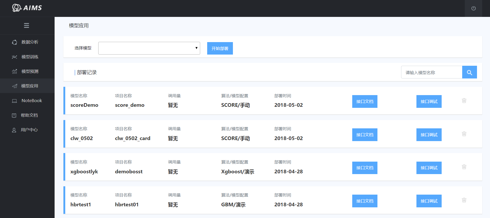

__由于可写案例实在太多 创作小哥正在夜以继日的书写整理中 敬请期待__

# 案例一：基于CcxBoost算法的信用卡违约预测模型

本案例为通过AIMS平台为使用者依据实际业务数据，演示智能建模的整个过程。整个过程包括：案例背景介绍，案例目标确定，数据认知与分析，模型建立，结果解读，模型部署几大部分。其中模型建立中，我们将采用CcxBoost算法进行建模。

### 1.案例背景

本研究针对台湾客户违约支付的情况，预测用户未来的违约概率。从风险管理的角度来看，违约概率的预测精度比分类可信或不可信客户的二元结果更为有价值。数据来源于UCI，数据下载[地址](http://archive.ics.uci.edu/ml/datasets/default+of+credit+card+clients#)。

下表为数据集中数据字段的详细解释：

|英文变量名|英文注释|中文含义|数据类型|
|-|-|-|--|
|ID|index|样本索引|连续型|
|LIMIT_BAL|Amount of the given credit (NT dollar): it includes both the individual consumer credit and his/her family (supplementary) credit.|信用卡总额度|连续型|
|SEX|Gender (1 = male; 2 = female)|性别（1=男，2=女）|离散型|
|EDUCATION|Education (1 = graduate school; 2 = university; 3 = high school; 4 = others).|学历（1=研究生，2=大学本科，3=高中，4=其他）|离散型|
|MARRIAGE|Marital status (1 = married; 2 = single; 3 = others). |婚姻状态（1=已婚，2=单身，3=其他）|离散型|
|AGE|Age (year). |年龄|连续型|
|PAY_0| History of past payment. the repayment status in September, 2005;|2005年9月的偿付状态|连续型|
|PAY_2| the repayment status in August, 2005; |2005年8月的偿付状态|连续型|
|PAY_3| the repayment status in July, 2005;|2005年7月的偿付状态|连续型|
|PAY_4| the repayment status in June, 2005;|2005年6月的偿付状态|连续型|
|PAY_5| the repayment status in May, 2005;|2005年5月的偿付状态|连续型|
|PAY_6|the repayment status in April, 2005;The measurement scale for the repayment status is: -1 = pay duly; 1 = payment delay for one month; 2 = payment delay for two months; . . .; 8 = payment delay for eight months; 9 = payment delay for nine months and above. |2005年4月的偿付状态 其中 -1为按时偿付，1至9代表了逾期的月份数|连续型|
|BILL_AMT1|Amount of bill statement (NT dollar).amount of bill statement in September, 2005;|2016年9月票据金额|连续型|
|BILL_AMT2|amount of bill statement in August, 2005; |2016年8月票据金额|连续型|
|BILL_AMT3|amount of bill statement in July, 2005; |2016年7月票据金额|连续型|
|BILL_AMT4|amount of bill statement in June, 2005; |2016年6月票据金额|连续型|
|BILL_AMT5|amount of bill statement in May, 2005; |2016年5月票据金额|连续型|
|BILL_AMT6|amount of bill statement in April, 2005. |2016年4月票据金额|连续型|
|PAY_AMT1|Amount of previous payment (NT dollar). amount paid in September, 2005;|2005年9月支付金额|连续型|
|PAY_AMT2| amount paid in August, 2005; |2005年8月支付金额|连续型|
|PAY_AMT3| amount paid in July, 2005;|2005年7月支付金额|连续型|
|PAY_AMT4| amount paid in June, 2005;|2005年6月支付金额|连续型|
|PAY_AMT5| amount paid in May, 2005;|2005年5月支付金额|连续型|
|PAY_AMT6| amount paid in April, 2005. |2005年4月支付金额|连续型|
|default_payment_next_month|default payment next month，default payment (Yes = 1, No = 0)|目标变量，信用卡客户下一个月是否会违约（1=违约，0=不违约）|离散型|

### 2.数据认知与分析

在使用AIMS进行建模之前，我们需要将准备好的数据上传至AIMS平台，上传时支持txt,csv文件的数据格式。数据上传截图如下：

数据上传成功后，我们首先需要对数据的变量进行类型的标记，如本例中的MARRIAGE即为离散型。数据的类型标记功能可以通过点击“类型标记”按钮即可完成。标记完成后点击“确定”按钮。后续将触发后台对数据进行探索性的描述性分析和单变量分析。
其中探索性的描述性分析结果如下：

从分析结果中，AIMS平台自动为我们计算了详细的统计指标，如缺失值个数，缺失比例，IV值，取值个数等。其中此表格支持点击排序，便于用户进行变量间的比较。这样能更好的帮助我们了解我们的数据，认知数据的基本指标，对于后续的建模有着重要的作用。
除了变量的描述性分析结果，AIMS还自动计算了每一个变量与目标变量间如何变动的衡量指标IV值，并将结果进行了可视化的展示。从图中，我们可以清晰的看到每一个变量不同取值下目标变量的分布是如何变化的，这样能帮助我们更好的了解我们每一个变量对目标变量的影响程度。

在数据探索阶段，我们还需要对变量间的相关性，数据的异常值进行检验。AIMS平台通过下载数据分析报告，可以帮助我们了解数据的info信息，变量间的关系信息，和每一个变量的取值信息。以一个精美的HTNL网页文档的形式体现。具体样式如下：

### 3.模型训练

对数据集基本信息深入了解后，我们便可以用AIMS平台建立第一个模型，点击模型训练按钮。这里我们采用CcxBoost算法建立模型，模型配置选择演示，寻优方式选择网格搜索。点击开始，既可以等待模型的训练过程。其中，AIMS平台对运行的模型，我们记录了详细的日志信息，供用户查看，可以通过点击图示的按钮来查看训练过程中的详细信息。本例中日志截图如下：

AIMS智能建模团队，经过不断的探索与优化，极大的提升了模型训练的效率和准确率，如本例中，整个模型训练的过程仅用时12秒，12秒的时间里分别包括，数据集划分，5折交叉验证，超参数网格寻优，模型建立，模型比较与选择，模型评价指标计算，最终结果保存与输出。
当模型训练完毕后，点击模型报告，即可看到详细的模型报告。其中包括了：模型数据概览、模型评估指标、ROC/KS曲线、概率分组详情、概率分箱图、TOP20变量分析图、变量重要性排序/变量统计指标。详细信息见下图：

### 4.模型部署

当我们训练好模型之后，当模型精确程度达到了我们的预期，最终我们采用线上一键部署的方式，部署到后台服务器，以API接口的形式，进行实时的计算，并返回预测结果。其中接口支持单条形式，也支持批量形式。

